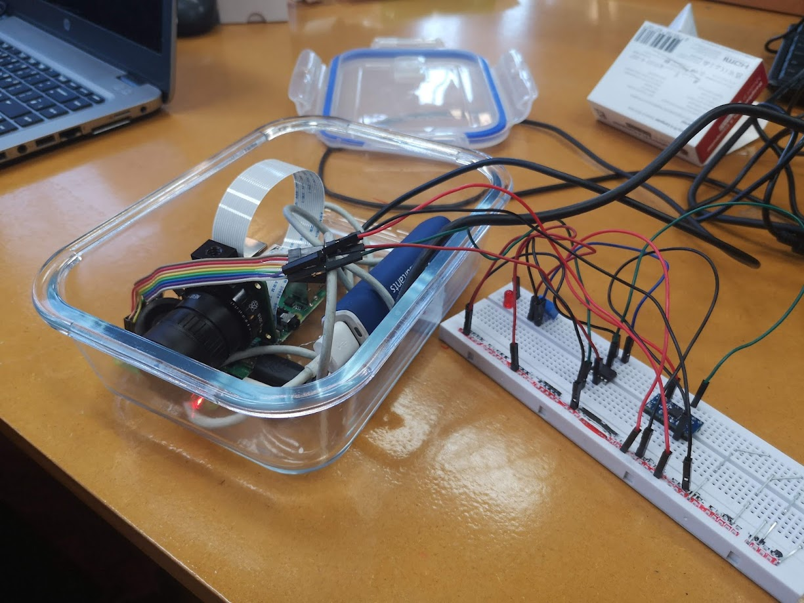
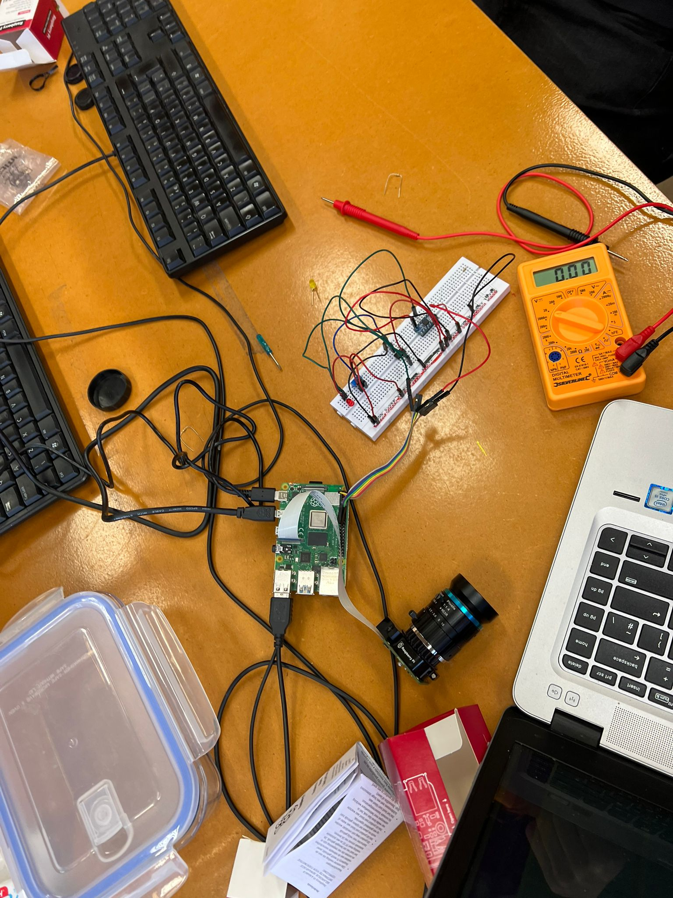

# FridgeGuard

FridgeGuard catches domestic food thieves in the act, keeping your groceries safe in shared university kitchens.

### Hardware

- Raspberry Pi 4, 
- Wide angle camera 
- Breadboard with an accelerometer
- USB power supply

### Usage

1. Connect your Raspberry Pi to a monitor and power pack
2. Run `main.py`, making sure you have the appropriate dependencies installed
3. Disguise the FridgeGuard and place it in hiding. 

### Technical Challenges

Unfortunately, battery tech has not advanced enough to leave cameras recording for multiple days on a power pack.
To work around this, we use an accelerometer which detects when the fridge door is opened.
The circuitry alerts the Rasberry Pi, which promptly begins recording.

### Bonus Features: Face Detection

Hit <kbd>Ctrl</kbd>-<kbd>c</kbd> to process saved recordings for faces.

